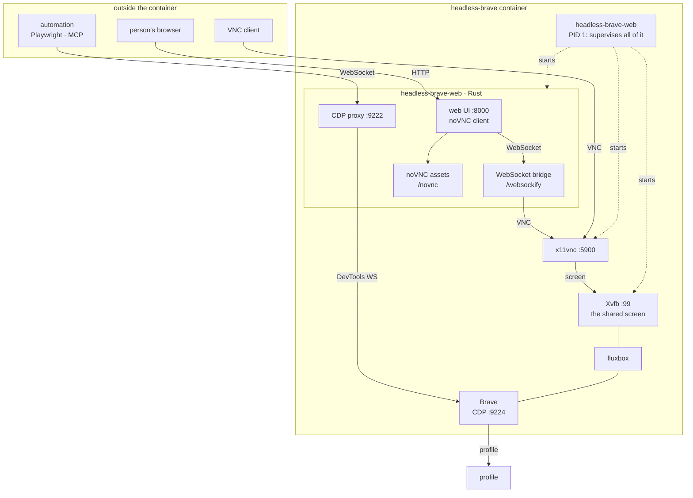

# Headless Brave

Run Brave in a container with a VNC desktop, a web-based VNC client, and
Chrome DevTools Protocol access — for AI agents and browser automation.

The browser belongs to whoever is driving it over CDP. A desktop is available
for anyone who wants to look, and as many of them as like: watching never
disturbs the driver, and no viewer can take the screen away from the agent or
from another viewer.

## What it does

- Runs Brave on a virtual screen, started once at boot and kept alive, so the
  browser is there whether or not anyone is watching
- Shares that screen over VNC on port `5900`, to any number of clients
- Serves the same screen to a browser on port `80`, through noVNC
- Exposes CDP on port `9222` for Playwright, Puppeteer and friends
- Runs the browser as an unprivileged user, with its own sandbox on, so a
  compromised page is confined to the browser's renderer rather than the
  container
- Ships a Rust service (`headless-brave-web`) that serves the web UI, the
  noVNC client and both WebSocket bridges; there is no Python anywhere in the
  image

## Quick start

Pull the published image, built weekly from `main`:

```bash
podman run -d --name headless-brave \
  -p 127.0.0.1:8000:8000 -p 127.0.0.1:5900:5900 -p 127.0.0.1:9222:9222 \
  -v headless-brave-data:/data -v headless-brave-opt:/opt \
  ghcr.io/delnegend/headless-brave:latest
```

Or build it yourself, which is the same thing from source:

```bash
docker compose up -d --build
```

Both give you a container that keeps its own browser up to date.

The ports are published on the IPv4 loopback only. `localhost` resolves to
`::1` first on many systems, and podman does not forward IPv6 loopback, so
spell out `127.0.0.1` — for the web UI, for VNC clients, and in the MCP
configuration below.

### Connect via the web UI

```
http://127.0.0.1:8000/
```

The page is nothing but the desktop: it attaches on load, and there is nothing
to press. Click to type, and it reconnects on its own if the screen goes away.

### Connect via VNC

```
Host: 127.0.0.1
Port: 5900
Password: headless
```

Any VNC client will do. The screen is shared, so you can watch alongside
somebody else, and a viewer leaving never disturbs the browser. Typing is
possible, but nothing a viewer does reaches the agent's session any differently
than the agent's own work does.

### Connect via CDP (for AI agents)

<details>
<summary><b>opencode</b></summary>

`~/.config/opencode/opencode.jsonc`:
```jsonc
{
  "$schema": "https://opencode.ai/config.json",
  "mcp": {
    "browser": {
      "type": "local",
      "command": ["npx", "-y", "@playwright/mcp", "--cdp-endpoint", "ws://127.0.0.1:9222"],
      "enabled": true
    }
  }
}
```

</details>

<details>
<summary><b>Claude Code</b></summary>

`~/.claude/settings.json`:
```json
{
  "mcpServers": {
    "browser": {
      "command": "npx",
      "args": ["-y", "@playwright/mcp", "--cdp-endpoint", "ws://127.0.0.1:9222"]
    }
  }
}
```

</details>

<details>
<summary><b>Zed</b></summary>

Add to `~/.config/zed/settings.json`:
```json
{
  "browser": {
    "command": "npx",
    "args": ["-y", "@playwright/mcp", "--cdp-endpoint", "ws://127.0.0.1:9222"],
    "env": {}
  }
}
```
</details>

Or connect directly with Playwright:

```javascript
const { chromium } = require('playwright');
const browser = await chromium.connectOverCDP('ws://127.0.0.1:9222/');
const [page] = browser.contexts()[0].pages();
await page.goto('https://example.com');
```

## Keeping data

The browser's profile — cookies, logins, history, extensions, local storage —
lives on a named volume at `/data`, so it survives a rebuild, a recreate and a
plain restart. Anything you log into on the web UI is still logged in next
time.

The browser itself lives on a second volume, at `/opt`, and is installed the
first time the container starts. Only the shared libraries it links against are
in the image, so a new Brave release costs a restart rather than a rebuild.

**It keeps itself up to date.** Every six hours the service asks Brave's
repository whether a newer release exists, and installs it if so — no flag, no
restart, nothing for you to remember. Brave ships security releases weekly at
best, and a container nobody touches should not be the reason a known browser
fix goes unpicked.

Installing an update restarts *only* the browser. Xvfb, fluxbox, x11vnc and the
web service stay up, so a VNC session survives and the window simply comes back
after a few seconds. What does not survive is whatever the browser was in the
middle of: an unattended update takes whatever the automation was doing with
it. Anything the browser does that you care about should be driven from the
CDP side, where a reconnect is the caller's problem to handle.

A repository that cannot be reached is not a problem — the working browser is
left alone and the next check tries again.

```bash
docker compose down -v   # throws the profile and the browser away
```

To keep the profile somewhere on the host instead, replace the volume with a
bind mount and point `BRAVE_PROFILE` at it:

```yaml
    volumes:
      - /srv/headless-brave:/data
```

Nothing in the container runs as root, so nothing is handed over at start: the
profile is written by, and belongs to, uid 1000 from the first boot. A bind
mount therefore has to be that user's, or the browser comes up with a profile
it cannot write:

```bash
install -d -o 1000 -g 1000 /srv/headless-brave
```

The named volumes in `compose.yaml` need none of this — the image creates the
directories they are mounted over, and a volume inherits their ownership.

One thing to know: a persisted profile keeps Chromium's single-instance lock,
which names a process that no longer exists after a stop. The service clears
it before launching the browser — without that, Brave refuses to start and the
container comes up with no browser at all. For the same reason the browser is
told not to offer session restore: every stop looks like a crash to it, and the
"Restore pages?" bubble would sit on the shared desktop covering whatever the
agent was doing.

## Customization

| Variable | Default | Description |
|---|---|---|
| `RESOLUTION` | `1920x1080` | Size of the virtual screen |
| `BRAVE_PROFILE` | `/data/profile` | Where the browser keeps its profile; the compose file mounts a volume here |
| `BRAVE_ROOT` | `/opt/brave.com` | Where the browser is installed; the compose file mounts a volume here |
| `VNC_DISPLAY` | `:99` | X display the browser runs on |
| `VNC_PORT` | `5900` | Port x11vnc serves the screen on |
| `VNC_PASSWORD` | `headless` | VNC password, stored on every boot |
| `BIND_ADDR` | `0.0.0.0` | Address the web UI and CDP proxy listen on. `127.0.0.1` keeps them inside the container's network namespace |
| `WEB_PORT` | `8000` | Port for the web UI and its bridge |
| `VNC_HOST` | `127.0.0.1` | Address x11vnc is reached on, by the web UI's bridge inside the container |
| `CDP_PORT` | `9222` | Port for the CDP proxy |
| `BROWSER_CDP_URL` | `http://127.0.0.1:9224/json/version` | Brave's DevTools endpoint, used to find its WebSocket |
| `NOVNC_DIR` | `/usr/share/novnc` | Where the noVNC client is installed |
| `RUST_LOG` | `headless_brave_web=info,warn` | Log filter for `headless-brave-web` |

**There is no authentication, and there is no plan for one.** Ports `8000` and
`9222` do not authenticate the *caller* at all: anyone who can reach them can
watch the screen, type into it, or drive the browser — and therefore reach
anything you have logged in to. Port `5900` asks for a password, but the web UI
fetches it from `/api/config` and hands it to whoever asks, so it protects
nothing from someone who can reach `8000`.

Treat the container as one process you either expose or you do not. The compose
file publishes all three ports on loopback for that reason; `BIND_ADDR` is the
knob inside the container. If you need it off-host, put an authenticating
reverse proxy in front, and be aware that what you are protecting is a browser
with a persistent, logged-in profile.

## When something is wrong

**The container restarted and the log says which part stopped.** It is a
supervisor: if Xvfb, fluxbox, the browser or x11vnc exits, the container exits
with it and the restart policy starts a fresh one. The last line before the
stopping message names the culprit.

```bash
docker compose logs --tail=50 brave
```

**`web` never answers.** The first boot downloads the browser, so it needs the
network and takes a little longer than later starts. If it never comes up, the
log says why: no network, or a browser package that would not download.

**The screen is blank but the container is up.** The browser is probably still
installing, or an update is mid-restart. Both take a few seconds and log it.

**An update failed.** A repository that could not be reached is not a failure —
the working browser is left alone and the next check, six hours later, tries
again. A failed *install* is different: the container exits deliberately so the
next start rebuilds the browser from scratch rather than limping along with a
half-written one. If a container is restarting in a loop, the log line naming
the failing step is the answer; `/opt/.headless-brave-staging` is a leftover
from an interrupted swap and is safe to delete.

**Brave refuses to start and mentions a lock or a profile.** A stop that was not
clean leaves Chromium's single-instance lock naming a process that no longer
exists. The service clears those before starting, so seeing this usually means
the profile is unusable for a different reason — most often it belongs to
root, because it was created by an older container. A bind mount has to be
uid 1000: `install -d -o 1000 -g 1000 /path/to/profile`.

**The VNC client connects and shows nothing useful.** Check `VNC_PASSWORD` — it
is generated at start and the web UI reads it from `/api/config`. A password
with shell metacharacters is not the problem; an empty one is refused outright.

**Logs.** The container writes to its own log file, not the journal, because
the browser's own output is voluminous enough to get a journal's rate limiter
to drop the service's lines. `docker compose logs` reads the file.

## How it works



The screen is started at boot, not by anyone looking at it. That is
what keeps the browser — and therefore CDP — alive whether or not a viewer is
attached.

The web UI is a thin page around noVNC's client library, which the distribution
installs at `/usr/share/novnc` and the service serves from there. noVNC speaks
WebSocket, x11vnc speaks TCP, and the `/websockify` endpoint in between is a
plain byte relay — a VNC session is binary from the first challenge on, so
nothing on that path may go through a string.

The page is sent its connection settings by the container, not asked for them,
so there is nothing on screen to fill in.

## Files

| File | Purpose |
|---|---|
| `Dockerfile` | Builds the Rust service, and the runtime image around Brave's dependencies and x11vnc |
| `src/` | `headless-brave-web` — the whole container: the browser install, the screen, the window manager, x11vnc, the web UI, the VNC bridge, the CDP proxy and the noVNC assets |
| `web/` | The page and its script |
| `.devcontainer/` | Development container |
| `docker-compose.yml` | Port mappings, profile volume and defaults |

Working on it is covered in [docs/development.md](docs/development.md): the dev
container and the checks.

## License

MIT. Uses [noVNC](https://novnc.com), MPL-2.0, served from the distribution's
package rather than vendored.
