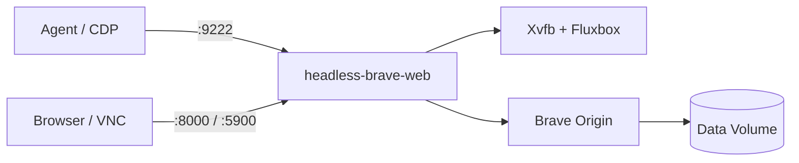

<div align="center">

# Headless Brave

**Run Brave Origin in a container with a VNC desktop, an in-browser client, and DevTools Protocol access for AI agents.**

[](https://github.com/Delnegend/headless-brave/actions)
[](https://github.com/Delnegend/headless-brave/releases)
[](LICENSE)

</div>

---

## Quick Start

Get running in less than 60 seconds:

```bash
# 1. Pull published image
podman pull ghcr.io/delnegend/headless-brave:latest

# 2. Run container
podman run -d --name headless-brave --shm-size=2g \
  -p 127.0.0.1:8000:8000 -p 127.0.0.1:5900:5900 -p 127.0.0.1:9222:9222 \
  -v headless-brave-data:/data -v headless-brave-opt:/opt \
  ghcr.io/delnegend/headless-brave:latest
```

Visit `http://127.0.0.1:8000` to view the desktop, or connect agents via `ws://127.0.0.1:9222`.

## Highlights

- **Persistent automation** — Browser and virtual screen run continuously, keeping CDP connections alive whether or not anyone is watching.
- **Shared non-intrusive viewing** — Watch automation live via web UI (`:8000`) or VNC (`:5900`) without stealing focus from the agent.
- **Unprivileged sandbox confinement** — Runs as UID 1000 with Chromium's native user-namespace sandbox enabled; renderers stay isolated.
- **Self-updating browser engine** — Automatically polls upstream Brave Origin releases every 6 hours and updates `/opt` without losing container state.
- **Zero external runtime dependencies** — Powered by a single static Rust binary (`headless-brave-web`) embedding web assets and WebSocket relays.

## Common Options

```bash
# Or start via Compose from source
docker compose up -d
```

| Option | Default | Description |
|---|---|---|
| `-p 127.0.0.1:8000:8000` | `8000` | Web UI and embedded noVNC viewer |
| `-p 127.0.0.1:5900:5900` | `5900` | Direct VNC server (password: `headless`) |
| `-p 127.0.0.1:9222:9222` | `9222` | Chrome DevTools Protocol (CDP) WebSocket proxy |
| `BRAVE_PROFILE` | `/data/profile` | Persistent browser profile (cookies, logins, history) |
| `RESOLUTION` | `1920x1080` | Virtual desktop display resolution |

For all environment variables, MCP client setups (Claude Code, opencode, Zed), and volume storage, see **[Configuration Reference](docs/configuration.md)**.

## Architecture



For process supervision, WebSocket relays, and self-update internals, see **[Architecture Guide](docs/architecture.md)**.

## Documentation

- **[Configuration](docs/configuration.md)** — Environment variables, MCP client setups, and volume persistence.
- **[Architecture](docs/architecture.md)** — System supervisor, WebSocket bridges, update cycles, and troubleshooting.
- **[Development](docs/development.md)** — Running checks, build steps, and smoke tests.

## License

[MIT](LICENSE)
