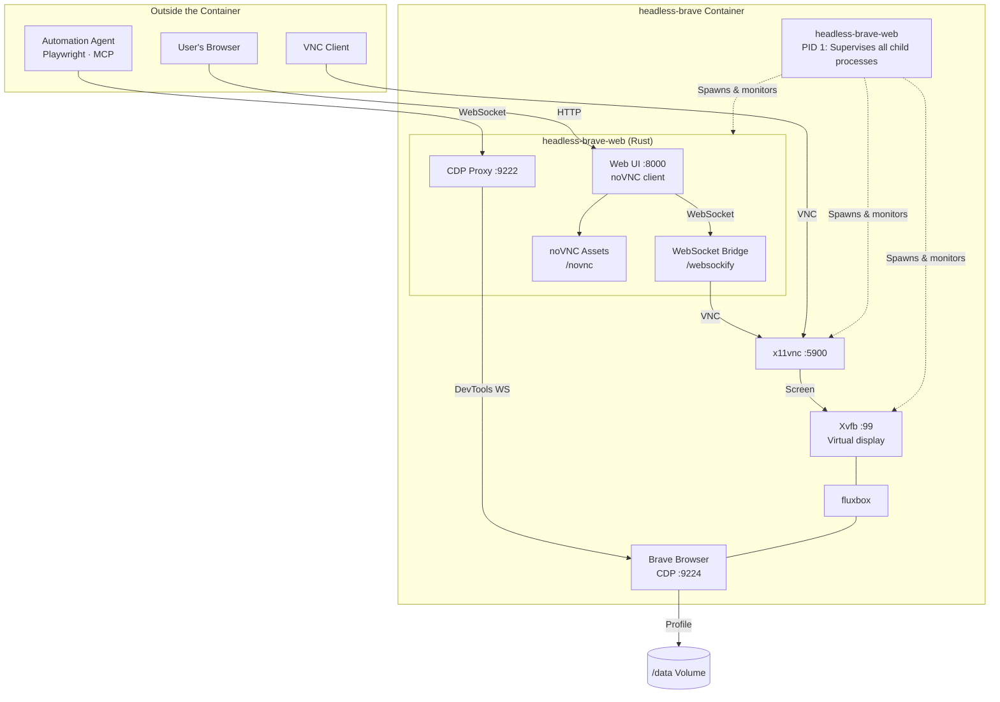
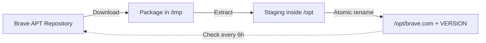

# Architecture & Internals

`headless-brave` packages Brave Browser inside an unprivileged container with a persistent virtual desktop, an in-browser VNC client, and a Chrome DevTools Protocol (CDP) bridge.

## System Overview



## Core Components

- **`headless-brave-web` (PID 1):** Single compiled Rust binary that acts as the container supervisor. It initializes storage directories, installs Brave on first boot, clears stale browser locks, launches child processes, and triggers container exit if any child fails so the container runtime can restart it cleanly.
- **Xvfb & Fluxbox:** Runs a virtual display on `:99` (`-noreset -nolisten tcp`). The screen runs continuously from boot, decoupling browser visibility from active viewers.
- **Brave Browser:** Runs with native user-namespace sandboxing under user `headless` (UID 1000). It exposes internal DevTools on `127.0.0.1:9224`.
- **x11vnc:** Serves the Xvfb desktop on port `5900` (`-shared -forever`).
- **WebSocket Relays:** Embedded inside `headless-brave-web`:
  - `/websockify`: Streams raw binary VNC traffic between noVNC WebSockets and local TCP port `5900`.
  - CDP Proxy (`:9222`): Resolves Brave's dynamic DevTools WebSocket URL from `http://127.0.0.1:9224/json/version` and relays automation commands transparently.

## Self-Updating Browser

The Rust supervisor checks Brave's upstream APT repository every 6 hours:



1. **Volume Isolation:** Brave lives in `/opt`, separate from container root. An update requires downloading and unpacking into staging, followed by an atomic filesystem rename.
2. **Targeted Restart:** Updating restarts only the browser process. Xvfb, fluxbox, x11vnc, and the web service remain running without dropping viewer connections.
3. **Lock Clearing:** Chromium locks the profile with a single-instance lock file. Upon abnormal exit or update, the supervisor strips stale lock symlinks before restarting the browser.

## Troubleshooting

### Container restarted unexpectedly
The container acts as a supervisor: if Xvfb, fluxbox, x11vnc, or Brave exits unexpectedly, the supervisor shuts down the container so the host restart policy can recover it. Inspect the last log lines to identify the stopped process:

```bash
docker compose logs --tail=50 brave
```

### Web UI does not respond
On initial start, the container downloads and unpacks Brave before opening web listeners. If the service never responds, check the container logs for network failure or repository unreachable errors.

### Screen is blank
The browser may still be installing or undergoing an in-place restart following an update. Both events take several seconds and are logged.

### Browser fails with "No usable sandbox!"
The browser requires unprivileged user namespaces. Environments that disable user namespaces (e.g. strict AppArmor profiles or restrictive container hosts) cannot run the unprivileged sandbox. The fix must be applied on the host kernel/container engine configuration.

### Profile lock errors
If Brave reports an existing lock or unusable profile, an older container may have created root-owned files in the profile directory. Ensure all files inside `/data` are owned by UID 1000:

```bash
install -d -o 1000 -g 1000 /path/to/profile
```

### Checking health manually
Run the included smoke test script to verify all interfaces (Web UI, noVNC, CDP bridge, sandbox status, unprivileged execution):

```bash
./scripts/smoke.sh
```
