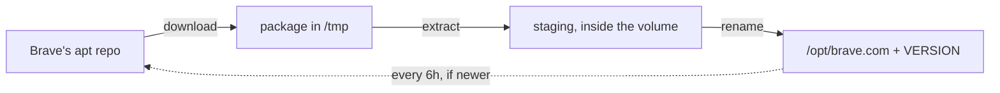

# Development

How to work on headless-brave: the dev container, the checks, and the parts of
the image that are easy to break by accident.

For what the thing does and how to run it, see the [README](../README.md).

## Checks

The dev container (`.devcontainer/`) has Rust stable, clippy, rustfmt, mold and
podman, so the image can be built and run from inside it.

```bash
# the CI gate, and what to run before pushing
just check

# the same thing by hand
cargo fmt --check
cargo clippy --all-targets -- -D warnings
cargo test

# the whole image
podman build -t headless-brave:local .
podman run --rm --shm-size=2g \
  -p 127.0.0.1:8000:8000 -p 127.0.0.1:5900:5900 -p 127.0.0.1:9222:9222 \
  --security-opt label=disable headless-brave:local
```

`--shm-size` is not optional: Chromium is unhappy on Docker's 64 MB default.

### Lints

`[lints.clippy]` in `Cargo.toml` turns on `pedantic` and `nursery` and denies
everything that can abort at runtime — `unwrap_used`, `expect_used`,
`indexing_slicing`, `arithmetic_side_effects`, `panic`, `unreachable`, `todo`,
`string_slice`, `exit`, `as_conversions`. The set follows
[this post](https://www.namtao.com/rust/); `clippy.toml` allows the assertion
lints inside tests.

A WebSocket bridge in a container has no user to report a panic to: the task
dies, the desktop keeps running with no way in, and the only trace is one line
in `docker logs`. Adopting the set found three such deaths — a close reason cut
on a byte count that can land inside a character, a percent-decoder indexing
past the end of its input, and a static path that could climb out of the noVNC
tree — all now checked, with tests for the boundaries.

`nursery` churns between Rust releases, so a toolchain bump surfaces new
findings. `rust-toolchain.toml` pins the version the image is built with.

## One binary is the container

`headless-brave-web` is PID 1. It installs the browser if the volume is empty,
clears the locks a killed process left behind, starts Xvfb, fluxbox, the browser
and x11vnc, serves the web UI, and takes the whole container down if any of them
exits so the restart policy can start a fresh one. No entrypoint script, and no
second place the configuration is parsed.

Nothing runs as root: the image creates a `headless` user and the service is it,
so the install, the screen, the browser and both servers share one unprivileged
owner. The volumes are created by the image for the same reason — a volume
inherits the ownership of the directory it is mounted over.

`SIGTERM` is a clean path: children are asked to stop, given five seconds, then
killed, which is long enough for the browser to close its profile.

## What comes from where

| In the image | On a volume |
|---|---|
| Xvfb, fluxbox, x11vnc, noVNC, fonts | the browser itself |
| Brave's shared libraries | the profile: cookies, logins, history |
| the Rust service | |

The libraries move far less often than the browser, so keeping its payload out
means a new Brave costs a restart rather than a rebuild.



Staging is inside the volume because `rename()` cannot cross filesystems.

- **noVNC** — the distro's `novnc` package, served from `/usr/share/novnc`.
- **Brave** — installed at start, then every 6h: security releases are weekly
  and this is the container nobody remembers to update.
  - download + extract, not `apt-get install`: no root, no dpkg database
  - index under `/tmp`; `VERSION` records what is installed, and a repository
    it cannot ask is not an upgrade
- **The browser** — as `headless`, so no `--no-sandbox`.
  - only user namespaces work, so the SUID helper the package ships is deleted:
    an unprivileged extract cannot chown it root, and Chromium picks it on
    *presence*, then aborts instead of falling back
  - `check_sandbox` fails first, in one line, if there are no namespaces

### Flags that are easy to undo

| Service | Flag | Why |
|---|---|---|
| x11vnc | `-shared` | several people watch at once |
| x11vnc | `-forever` | keeps serving after the last viewer leaves; the browser is driven over CDP, not by whoever is looking |
| Xvfb | `-noreset` | the screen survives the browser restarting for an update |
| Xvfb | `-nolisten tcp` | nothing outside the container reaches the X socket |

## Layout

| Path | What lives there |
|---|---|
| `src/main.rs` | entry point: tracing, config, then the supervisor |
| `src/config.rs` | every environment variable, parsed once |
| `src/supervise.rs` | PID 1 — installs the browser, starts everything, stops it if one part dies |
| `src/web.rs` | routes, and the static handler for the noVNC tree |
| `src/bridge.rs` | the two WebSocket relays |
| `src/cdp.rs` | finding the browser's DevTools WebSocket |
| `src/assets.rs` | the embedded page and script |
| `web/` | the page and its script, embedded from here |
| `Dockerfile` | the image |
| `compose.yaml` | ports, volumes, log driver |
| `justfile` | `just check`, which is the CI gate |
| `scripts/smoke.sh` | functional check against a running container |
| `clippy.toml` | test allowances for the strict lint set |

## Testing notes

`cargo test` covers the decoders and the file handler: the percent-decoder, the
close-reason truncation, and refusing a noVNC path that climbs out of its tree.
These are where a malformed input from a peer could take the service down.

Everything else needs a real container, and `scripts/smoke.sh` asks the running
one — the web UI, the noVNC client, the browser process, the CDP bridge, and the
two invariants worth protecting: nothing runs as root, and the sandbox is on.

```bash
./scripts/smoke.sh
CONTAINER=brave-headless CDP_PORT=9222 ./scripts/smoke.sh
```

It uses docker or podman, whichever the host has. CI runs part of this
automatically, but not all of it: GitHub-hosted runners forbid unprivileged
user namespaces, so the full check needs a normal Linux host.

One thing nothing can automate: open the page twice and confirm both viewers stay
connected and neither bounces the other.
